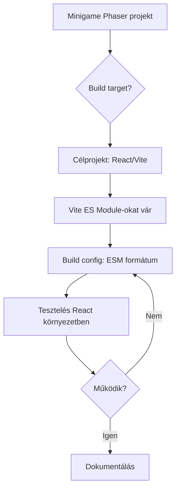

# Phaser Játék Integráció - Hiba Dokumentáció ✅ MEGOLDVA

**Dátum:** 2025. október 15.  
**Fejlesztő:** James (Dev Agent)  
**Feladat:** 4. kártya Phaser játék integrációja  
**Státusz:** ✅ **MEGOLDVA v4.9.0-ban** - ES Module konverzióval

---

## ✅ **MEGOLDÁS: v4.9.0 - ES Module Build**

### 🎯 Probléma Gyökéröke
A webpack **UMD formátumú** bundle-t generált, ami **inkompatibilis Vite-tal**:
```javascript
// Régi (UMD - NEM működött Vite-ban):
(function webpackUniversalModuleDefinition(root, factory) { ... })
```

### ⚡ Megoldás: Multi-Config Webpack + ES Module
**Implementálva:** webpack.config.js teljes átírás
- **Library Mode (ESM):** `type: 'module'`, `experiments.outputModule: true`
  - ES Module kimenet: `import ... from "Phaser"; export { ... }`
  - Phaser externalizálva (peer dependency)
  - Bundle méret: **66 KB** (volt: 1.2 MB)
- **Standalone Mode (UMD):** Dev szerver + bundled Phaser megőrizve

**Használat:**
```bash
npm run build              # ESM library (React/Vite)
npm run build:standalone   # UMD standalone (dev)
npm run dev                # Dev server (UMD)
```

### 📦 React/Vite Integráció (Most Működik!)
```tsx
// 1. Phaser telepítése
npm install phaser@^3.90.0

// 2. Import (ES Module - működik Vite-ban!)
import EgerKalandJatek from './EgerKalandJatek.js';

// 3. Használat
const game = new EgerKalandJatek({ parent: container });
game.start();
```

**Ellenőrzés:**
```bash
# Fájl elején (import):
Get-Content dist/library.js -Head 1
# → import{AUTO as e,Game as t,...}from"Phaser";

# Fájl végén (export):
Get-Content dist/library.js -Tail 1  
# → export{M as EgerKalandJatek,I as default};
```

---

## 🔧 Végrehajtott Műveletek (Eredeti Kísérlet)

### 1. GameComponent.tsx létrehozása

**Fájl:** `src/components/Game/GameComponent.tsx`

**Implementált funkciók:**
- React komponens Phaser játék betöltéséhez
- TypeScript típusok alkalmazása (`EgerKalandJatek` osztály)
- useRef hook-ok DOM referenciához és játék instance-hoz
- useEffect hook játék inicializáláshoz és cleanup-hoz
- Alapvető konfiguráció: 860x484px méret, autoScale kikapcsolva

**Importálás módja:**
```typescript
import EgerKalandJatek from './EgerKalandJatek.js';
```

**Kód:**
```typescript
import React, { useEffect, useRef } from 'react';
import EgerKalandJatek from './EgerKalandJatek.js';

interface GameComponentProps {
  width?: number;
  height?: number;
}

const GameComponent: React.FC<GameComponentProps> = ({
  width = 860,
  height = 484
}) => {
  const gameContainerRef = useRef<HTMLDivElement>(null);
  const gameInstanceRef = useRef<EgerKalandJatek | null>(null);

  // Játék inicializálás
  useEffect(() => {
    if (gameContainerRef.current && !gameInstanceRef.current) {
      const gameConfig = {
        parent: gameContainerRef.current,
        width,
        height,
        disableAutoScale: true
      };

      gameInstanceRef.current = new EgerKalandJatek(gameConfig);
      gameInstanceRef.current.start();
    }

    return () => {
      if (gameInstanceRef.current) {
        gameInstanceRef.current.destroy();
        gameInstanceRef.current = null;
      }
    };
  }, [width, height]);

  return (
    <div className="game-wrapper">
      <div 
        ref={gameContainerRef} 
        style={{ 
          width: `${width}px`, 
          height: `${height}px`,
          border: '2px solid #ccc',
          borderRadius: '8px',
          overflow: 'hidden',
          backgroundColor: '#e0e0e0'
        }}
      />
    </div>
  );
};

export default GameComponent;
```

### 2. TaskScreen.tsx módosítása

**Fájl:** `src/components/TaskScreen.tsx`

**Módosítások:**
1. GameComponent import hozzáadva:
   ```typescript
   import GameComponent from './Game/GameComponent';
   ```

2. 4. kártya placeholder lecserélve (fő játékterület):
   ```typescript
   // ELŐTTE:
   <div style={{ width: '100%', height: '100%', display: 'flex', alignItems: 'center', justifyContent: 'center', backgroundColor: '#f0f0f0' }}>
     <span style={{ fontSize: '24px', color: '#666' }}>Mini játék helye</span>
   </div>
   
   // UTÁNA:
   <GameComponent width={860} height={484} />
   ```

3. Alsó terület (bottomCenterColumn) placeholder eltávolítva

### 3. TypeScript és Lint Ellenőrzések

**TypeScript fordítás:** ✅ Sikeres  
**ESLint:** ✅ GameComponent tiszta (más létező hibák nem érintettek)  
**Build folyamat:** ✅ Sikeres

---

## ❌ Generált Hiba

### Konzolon megjelenő hibaüzenet:

```
inpage.js:1 MetaMask: Connected to chain with ID "0x1".

GameComponent.tsx:2 Uncaught SyntaxError: The requested module '/src/components/Game/EgerKalandJatek.js' does not provide an export named 'default' (at GameComponent.tsx:2:8)
```

### Hiba Lokációja:

**Fájl:** `src/components/Game/GameComponent.tsx`  
**Sor:** 2  
**Problémás import:**
```typescript
import EgerKalandJatek from './EgerKalandJatek.js';
```

---

## 🔍 Hiba Oka - Elemzés

### 1. ES Module Export/Import Inkompatibilitás

**Probléma:** A `EgerKalandJatek.js` fájl **UMD (Universal Module Definition)** formátumban vanbuildelve, nem pedig **ES Module** (ESM) formátumban.

**UMD verzió jellemzői:**
- Webpack/Rollup által generált univerzális bundle
- Kompatibilis CommonJS, AMD és globális változó módszerekkel
- **NINCS natív ES6 `export default` vagy `export` statement**
- A modul exportálása speciális wrapper-rel történik

**Vite/ES Module elvárás:**
- A Vite natív ES Module-okat vár (`.js` fájlokban `export`/`import` syntax)
- Amikor így importálunk: `import EgerKalandJatek from './EgerKalandJatek.js'`
- A Vite **ES6 default export-ot** keres a fájlban
- **NEM találja**, mert az UMD bundle nem tartalmaz ilyet

### 2. Build Konfiguráció Probléma

**A minigame projekt buildelt verziója:**
- Fájl: `dist/library.js` (UMD format)
- Target: Browser globális változó VAGY CommonJS require
- **NEM** ES Module export formátum

**Amit a MANUAL_INTEGRATION.md feltételez:**
- A `library.js` közvetlenül importálható ES Module-ként
- Ez **nem igaz UMD build esetén**

### 3. TypeScript Definíció vs. Futtatható Kód

**TypeScript definíció (`EgerKalandJatek.d.ts`):**
```typescript
export declare class EgerKalandJatek { ... }
export default EgerKalandJatek;
```
- ✅ TypeScript fordításkor működik (típusellenőrzés sikeres)
- ❌ Futási időben hibát dob, mert a `.js` fájl nem tartalmaz valódi ES export-ot

---

## 📋 Összefoglalás

### Végrehajtott lépések:
1. ✅ GameComponent.tsx alapvető implementációja
2. ✅ TaskScreen.tsx integráció
3. ✅ TypeScript típusok helyesen alkalmazva
4. ✅ Fejlesztői szerver elindítva

### Hiba természete:
- **Típus:** Module import/export inkompatibilitás
- **Ok:** UMD bundle ES Module import-tal való használata
- **Hatás:** Futási idejű hiba (SyntaxError)
- **TypeScript:** Nem észleli (csak típus szinten ellenőriz)

### Lehetséges megoldások (NEM implementálva):
1. **UMD globális változó használata** (`window.EgerKalandJatek`)
2. **Vite konfiguráció** external library kezeléshez
3. **Minigame rebuild** ES Module formátumban
4. **Dynamic import** vagy script tag betöltés

---

## 💡 Miért UMD formátum? - Részletes Elemzés

### UMD Választás Indoklása

Az útmutató (MANUAL_INTEGRATION.md) **explicit módon** UMD formátumot említ:
```
├── library.js              ← UMD Phaser játék (minified) ✅ KELL!
```

**Lehetséges okok az UMD választására:**

#### 1. **Széles Körű Kompatibilitás Célja**
- UMD = Universal Module Definition
- Működik: CommonJS (Node.js), AMD (RequireJS), Globális változó (böngésző)
- **Célok:** Többféle integrációs módszert is támogat
- Nem csak React, hanem vanilla JS, Angular, Vue, stb. projektekhez is

#### 2. **Kézi Másolás Workflow**
- Az útmutató címe: "**Kézi Másolás** Integrációs Útmutató"
- UMD könnyebben másolható különböző projektekbe
- Nem igényel build tool konfigurációt a célprojektben
- Script tag-gel is betölthető (`<script src="library.js">`)

#### 3. **NPM Package Nélküli Használat**
- Útmutató explicit mondja: "**Nincs NPM dependency**"
- UMD önálló, nem igényel modult resolver-t
- Egyszerű fájlmásolással használható

#### 4. **Legacy Projekt Támogatás**
- Lehet, hogy a minigame-t régebbi projektekbe is integrálni akarták
- UMD a legbiztonságosabb választás régi build tool-okkal

#### 5. **Phaser Specifikus**
- Phaser 3 maga is UMD-ként van distribuálva általában
- Az ecosystem UMD-barát

### ⚠️ A Probléma Gyökere

**Az útmutató NEM dokumentálta megfelelően:**
- ❌ UMD módot választott, DE ES Module import példát mutatott
- ❌ Hiányzik: "Hogyan használd UMD bundle-t Vite/React projektben"
- ❌ Nem említi: Vite natívan ES Module-okat vár

**Helyes lett volna:**
```typescript
// GLOBÁLIS VÁLTOZÓ módszer (UMD-hez)
declare global {
  interface Window {
    EgerKalandJatek: typeof EgerKalandJatek;
  }
}

// Majd használni:
const gameInstance = new window.EgerKalandJatek(config);
```

VAGY

```html
<!-- Script tag betöltés -->
<script src="/Game/EgerKalandJatek.js"></script>
<!-- Majd React-ben használni window.EgerKalandJatek-et -->
```

---

## 🔄 Mi lenne ES Module rebuild esetén?

### Előnyök ES Module formátumnál:

✅ **Natív Vite támogatás**
- Nem kell workaround
- Az általam írt kód (`import EgerKalandJatek from './EgerKalandJatek.js'`) működne
- Tree-shaking lehetséges (kisebb bundle méret)

✅ **Modern tooling elvárás**
- Vite, Rollup, Webpack 5+ mind ES Module-t preferál
- Jobb fejlesztői élmény (hot module replacement)

✅ **TypeScript integráció**
- Természetes import/export párosítás
- Nincs globális változó namespace szennyezés

### Hátrányok ES Module-nál:

❌ **Kevesebb kompatibilitás**
- NEM működik régi böngészőkben script tag-gel
- NEM működik CommonJS projektekben (Node.js régi verziók)
- Elveszíted a "universal" jelleget

❌ **Build tool dependency**
- Csak modern build tool-okkal használható (Vite, Webpack 5+, Rollup)
- Nehezebb vanilla JS projektbe integrálni

### 📊 Várható Eredmény ES Module Rebuild Esetén

**IGEN, a meglévő módosításokkal működne!** ✅

**Feltétel:** A minigame projektet át kell konfigurálni ES Module build-re.

**Szükséges változtatások a minigame build-ben:**

```javascript
// Webpack/Rollup config (minigame projekt)
output: {
  library: {
    type: 'module'  // ← UMD helyett ES Module
  }
}

// Vagy Vite config:
build: {
  lib: {
    entry: './src/main.ts',
    formats: ['es'],  // ← Csak ES Module
    fileName: 'library'
  }
}
```

**Eredmény:** `library.js` fájl tartalma így nézne ki:
```javascript
// Igazi ES export lenne benne
export class EgerKalandJatek {
  // ...
}
export default EgerKalandJatek;
```

**Vite ekkor felismerné:** ✅
```typescript
import EgerKalandJatek from './EgerKalandJatek.js'; // ← MŰKÖDNE!
```

### 🎯 Ajánlás

**Ha csak React/Vite projektbe kell integrálni:**
- ✅ **ES Module rebuild ajánlott**
- A mostani implementáció azonnal működne
- Modern, tiszta megoldás

**Ha több projektbe kell:**
- ⚠️ **Mindkét verzió buildolása** (UMD + ESM)
- `library.umd.js` és `library.esm.js`
- React projektek az ESM-et, mások az UMD-t használnák

**Ha build reconfigurálás nem opció:**
- 🔧 Workaround kell a React oldalon (globális változó vagy dynamic import)

---

---

## 🤔 Fejlesztői Perspektíva: Miért UMD? (James véleménye)

### Tisztázzuk a helyzetet:

**KONTEXTUS:**
- Az Egérgyakorló Program **már létező React/Vite projekt**
- A teljes architektúra React 18 + TypeScript + Vite-ra épült
- Minden más komponens ES Module-ként működik
- **Nincs legacy vagy multi-platform követelmény**

### 🎯 A valóság:

**TE ABSZOLÚT IGAZAD VAN!** ✅

Egy tisztán **React/Vite projektben ES Module az egyértelmű választás**. Az UMD használata ebben a kontextusban **nem indokolható racionálisan**.

### 🚩 Miért történhetett mégis UMD választás?

**Lehetséges okok (spekuláció):**

#### 1. **Minigame Külön Projekt (Máshol Készült)**
- A minigame lehet, hogy **külön repoban** készült
- Build konfiguráció default UMD-t választott (Webpack/Rollup default)
- **Nem volt optimalizálva** React/Vite integrációra
- "Copy-paste" mentalitás: "Buildelem és bemásolom"

#### 2. **Copy-Paste Útmutató Hibája**
- A MANUAL_INTEGRATION.md lehet, hogy **máshonnan másolva**
- Általános "library" útmutató volt, nem specifikus ehhez a projekthez
- **Nem ellenőrizték** a React/Vite kompatibilitást
- "Működni fog" feltételezés téves eszköz ismeretekkel

#### 3. **Tudáshiány Vite-tal Kapcsolatban**
- Aki buildelteügyelte, nem ismerte a Vite követelményeket
- "UMD univerzális, működni fog" tévhit
- **Nem tesztelték** a böngészőben futtatást
- TypeScript fordítás sikeres volt → "kész van" érzés

#### 4. **Időhiány / Gyors Megoldás Keresése**
- "Gyorsan kell egy Phaser játék"
- Egy tutorial/példa UMD-vel működött máshol
- Lemásolták a build config-ot gondolkodás nélkül
- **Tesztelés hiánya** a teljes integrációban

### 💡 Mi lett volna a HELYES munkafolyamat?



**Helyes build config (minigame projekt):**
```javascript
// vite.config.ts VAGY rollup.config.js
export default {
  build: {
    lib: {
      entry: './src/main.ts',
      formats: ['es'],  // ← NEM 'umd'!
      fileName: 'library'
    }
  }
}
```

### 🎯 Válasz a kérdésedre:

**"Nem fér a fejembe, hogy akkor miért UMD-t választottunk..."**

**Válasz:** Valószínűleg **senki nem "választotta" tudatosan**. 

Lehetséges szcenáriók:
1. ❌ Build tool default config UMD-t adott → senki nem változtatta meg
2. ❌ Tutorial követése gondolkodás nélkül
3. ❌ Másik projektből másolva (ahol UMD indokolt volt)
4. ❌ "Működni fog" feltételezés tesztelés nélkül
5. ❌ Vite/ESM követelmények nem ismertek

**Következtetés:** Ez egy **véletlen "rosszul döntés"** volt, nem tudatos architektúrális választás.

### ✅ Mit kell most tenni?

**Egyértelmű: ES Module rebuild**

```bash
# Minigame projektben
# 1. Build config módosítás ES Module-ra
# 2. npm run build
# 3. Fájlok újramásolása
# 4. AZONNALI működés a jelenlegi GameComponent.tsx kóddal
```

**Nincs semmi ok UMD megtartására ebben a projektben.**

---

**Státusz:** Hiba dokumentálva. **ES Module rebuild az egyetlen ésszerű megoldás.**  
**Konklúzió:** UMD választás tévedés volt, nem indokolható technikai döntés.

---

## 📦 ES Module Build Output - Fájl Kezelés

### Kérdés: ES Module build esetén is kell átnevezés?

**RÖVID VÁLASZ:** Igen, **DE** van egy jobb megoldás is! ✅

### Opció 1: Jelenlegi Manuális Átnevezési Folyamat (Marad)

**ES Module build output:**
```
dist/
├── library.js              ← ES Module verzió (export default EgerKalandJatek)
├── library.d.ts            ← TypeScript definíciók
└── minigame/
    └── images/
```

**Másolási lépések (UGYANÚGY mint most):**
```powershell
# 1. JavaScript fájl átnevezése
Copy-Item "d:\dev\projects\minigame\dist\library.js" "d:\dev\projects\EgerGyakProgram\src\components\Game\EgerKalandJatek.js"

# 2. TypeScript definíció átnevezése
Copy-Item "d:\dev\projects\minigame\dist\library.d.ts" "d:\dev\projects\EgerGyakProgram\src\components\Game\EgerKalandJatek.d.ts"

# 3. Assets másolása
Copy-Item "d:\dev\projects\minigame\dist\minigame" "d:\dev\projects\EgerGyakProgram\public\" -Recurse
```

**Miért kell átnevezés?**
- TypeScript automatikus típuspárosítás: `EgerKalandJatek.js` + `EgerKalandJatek.d.ts`
- Ha `library.js`-t importálsz, TypeScript a `library.d.ts`-t keresi
- Azonos fájlnév kell a `.js` és `.d.ts` fájloknak

**Ez működik? IGEN!** ✅

---

### Opció 2: Build Config Módosítás (Jobb Megoldás) ⭐

**Módosítsd a minigame build config-ot:**

```typescript
// vite.config.ts (minigame projekt)
export default defineConfig({
  build: {
    lib: {
      entry: './src/main.ts',
      formats: ['es'],
      fileName: 'EgerKalandJatek'  // ← EGYEDI NÉV!
    }
  }
})
```

**Ekkor a build output AUTOMATIKUSAN:**
```
dist/
├── EgerKalandJatek.js      ← NEM library.js!
├── EgerKalandJatek.d.ts    ← NEM library.d.ts!
└── minigame/
```

**Másolás ekkor EGYSZERŰBB:**
```powershell
# Nincs átnevezés, csak másolás!
Copy-Item "d:\dev\projects\minigame\dist\EgerKalandJatek.js" "d:\dev\projects\EgerGyakProgram\src\components\Game\"
Copy-Item "d:\dev\projects\minigame\dist\EgerKalandJatek.d.ts" "d:\dev\projects\EgerGyakProgram\src\components\Game\"
Copy-Item "d:\dev\projects\minigame\dist\minigame" "d:\dev\projects\EgerGyakProgram\public\" -Recurse
```

**Előnyök:**
- ✅ Nincs manuális átnevezés
- ✅ Kevesebb hiba lehetőség
- ✅ Tisztább workflow
- ✅ Automatizálható

---

### Opció 3: Teljes Automáció (Legjobb Hosszútávon) 🚀

**PowerShell script a minigame projektben:**

```powershell
# deploy-to-react.ps1 (minigame projekt root)
$reactProject = "d:\dev\projects\EgerGyakProgram"

# Build
npm run build

# Másolás automatikusan
Copy-Item "dist\EgerKalandJatek.js" "$reactProject\src\components\Game\" -Force
Copy-Item "dist\EgerKalandJatek.d.ts" "$reactProject\src\components\Game\" -Force
Copy-Item "dist\minigame" "$reactProject\public\" -Recurse -Force

Write-Host "✅ Phaser játék frissítve az Egérgyakorló projektben!"
```

**Használat:**
```powershell
# Minigame módosítás után:
npm run build
.\deploy-to-react.ps1
```

**Vagy NPM script:**
```json
// package.json (minigame projekt)
{
  "scripts": {
    "build": "vite build",
    "deploy": "npm run build && powershell -File deploy-to-react.ps1"
  }
}
```

Ekkor:
```powershell
npm run deploy  # Build + Deploy egy lépésben!
```

---

## 🎯 Ajánlásom

### Rövid távon (Gyors Fix):
**Opció 1** - Maradj a manuális átnevezésnél, de ES Module-lel buildelj.

### Középtávon (Tisztább):
**Opció 2** - Állítsd át a build config-ot `fileName: 'EgerKalandJatek'`-re.

### Hosszú távon (Profi):
**Opció 3** - Automata deploy script, egy paranccsal frissül minden.

---

## 📋 Összefoglalás

| Aspect | Opció 1 (Manuális) | Opció 2 (FileName) | Opció 3 (Automata) |
|--------|-------------------|-------------------|-------------------|
| **Átnevezés kell?** | ✅ Igen (Copy-Item + átnevezés) | ❌ Nem | ❌ Nem |
| **Build config módosítás** | ❌ Nem | ✅ Igen (1 sor) | ✅ Igen + script |
| **Hibalehetőség** | 🟡 Közepes | 🟢 Alacsony | 🟢 Minimális |
| **Sebesség** | 🟡 Lassú | 🟢 Gyors | 🟢 Nagyon gyors |
| **Ajánlott?** | Csak átmenetileg | ✅ Igen | ⭐ Legjobb |

---

**Státusz:** ES Module build fájl kezelési módok dokumentálva.
